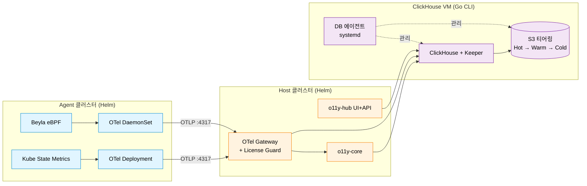
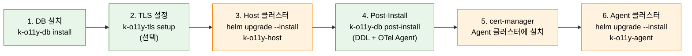

<div align="center">


# K-O11y Install

**K-O11y 스택 전체를 배포하기 위한 Helm 차트와 Go CLI 도구.**

[English](README.md) | [한국어](README.ko.md)

[](https://www.repostatus.org/#wip)
[](LICENSE)
[](https://helm.sh/)
[](https://kubernetes.io/)

[OpenTelemetry](https://opentelemetry.io/) · [Beyla eBPF](https://grafana.com/oss/beyla-ebpf/) · [ClickHouse](https://clickhouse.com/) 기반

</div>

---

## ✨ 포함 구성

- 📦 **Helm 차트 6개** — umbrella 차트 2개(`k-o11y-host`, `k-o11y-agent`) + sub-chart 4개
- 🛠️ **Go CLI 도구 2종** — `k-o11y-db`(ClickHouse VM 설치 + DB 에이전트), `k-o11y-tls`(cert-manager 설정)
- 💾 **ClickHouse DDL** — 50+ 테이블, 머티리얼라이즈드 뷰, Dictionary, 메타데이터 테이블
- 🔐 **TLS 모드** — `existing`, `selfsigned`, `private-ca`, `letsencrypt`
- 🌐 **SSH 모드** — `ssh`(기본), `bastion`(점프호스트), `local`(VM 직접 실행)
- 🗄️ **S3 티어링** — Hot(EBS) → Warm(S3 Standard) → Cold(S3 Glacier IR) 자동 라이프사이클
- 🔄 **자율형 DB 에이전트** — systemd 서비스. S3 Activate, Cold Backup, 파티션 정리를 자율 수행 (설치 후 SSH 의존성 없음)

---

## 🏗️ 아키텍처

K-O11y는 **2-tier Host-Agent 모델**을 사용합니다. Agent 클러스터가 OTLP로 Host 클러스터에 원격측정 데이터를 전송하고, ClickHouse는 전용 VM에서 동작하며 상주 DB 에이전트가 스토리지 티어링을 관리합니다.



**설치 흐름(6단계):**



---

## 📦 프로젝트 구조

```
k-o11y-install/
├── charts/                               # Helm 차트
│   ├── k-o11y-host/                      # Host umbrella (백엔드 + OTel Gateway)
│   ├── k-o11y-agent/                     # Agent umbrella
│   ├── k-o11y-otel-agent/                # OTel Collector (sub-chart)
│   ├── k-o11y-otel-operator/             # OTel Operator (sub-chart)
│   ├── k-o11y-apm-agent/                 # Beyla eBPF APM (sub-chart)
│   └── k-o11y-ksm/                       # Kube State Metrics (sub-chart)
│
├── cmd/
│   ├── k-o11y-db/                        # Go CLI: DB 설치 + 에이전트 + 업그레이드
│   │   ├── cmd/                          # cobra 서브커맨드 (install, post-install, uninstall, upgrade, agent)
│   │   ├── internal/
│   │   │   ├── agent/                    # DB 에이전트 (daemon, poller, s3_activator, backup, health)
│   │   │   ├── installer/                # 설치 로직 (keeper, clickhouse, agent, uninstall)
│   │   │   ├── ssh/                      # SSH 추상화 (ssh, bastion, local)
│   │   │   └── embed/                    # 내장 리소스 (DDL, 스크립트, 템플릿)
│   │   └── Makefile                      # 크로스 컴파일 (linux/darwin, amd64/arm64)
│   │
│   └── k-o11y-tls/                       # Go CLI: TLS 인증서 설정
│       ├── cmd/                          # cobra 서브커맨드 (setup)
│       ├── internal/
│       │   ├── tls/                      # 모드별 로직 (existing, selfsigned, private-ca, letsencrypt)
│       │   ├── kube/                     # kubectl/helm 래퍼
│       │   └── embed/                    # YAML 템플릿 (cert-manager CRD)
│       └── Makefile
│
└── upstream-versions.yaml                # Upstream 이미지 버전 추적
```

---

## 🚀 설치

> **사전 빌드된 Docker 이미지 / OCI 레지스트리 Helm 차트는 아직 배포되지 않았습니다.** [메인 레포지토리](https://github.com/Wondermove-Inc/k-o11y-server)에서 이미지를 빌드하여 자체 OCI 레지스트리(GHCR, Harbor 등)에 push한 뒤, 아래 Helm 차트도 패키징하여 push하세요.

### 사전 준비

| 항목 | 요구사항 |
|------|---------|
| ClickHouse/Keeper VM | Ubuntu 22.04 LTS, sudo SSH 계정, 8+ vCPU, 32GB+ RAM |
| Host K8s 클러스터 | Kubernetes 1.28+, Helm 3.12+, kubectl |
| Agent K8s 클러스터 | Kubernetes 1.28+, Linux 커널 5.8+ (Beyla eBPF용) |
| OCI Registry | 두 클러스터 모두에서 접근 가능한 `<YOUR_REGISTRY>` |

`K_O11Y_ENCRYPTION_KEY`를 미리 생성합니다 (Step 1, 3에서 동일한 값 사용):

```bash
openssl rand -hex 32
```

Go CLI 바이너리를 빌드합니다:

```bash
cd cmd/k-o11y-db && make build-all
cd cmd/k-o11y-tls && make build-all
```

Helm 차트를 자체 레지스트리에 패키징/푸시합니다:

```bash
helm package charts/k-o11y-host
helm push k-o11y-host-*.tgz oci://<YOUR_REGISTRY>/charts
```

### Step 1. DB 설치 + 에이전트 배포

```bash
./k-o11y-db install \
    --mode ssh \
    --ssh-user <SSH_USER> \
    --ssh-key <SSH_KEY_PATH> \
    --ssh-password '<SSH_PASSWORD>' \
    --keeper-host <KEEPER_IP> \
    --clickhouse-host <CLICKHOUSE_IP> \
    --clickhouse-password '<CLICKHOUSE_PASSWORD>' \
    --encryption-key <K_O11Y_ENCRYPTION_KEY> \
    --verbose --yes
```

**설치 항목**: Keeper, ClickHouse, clickhouse-backup, get-s3-creds, DB 에이전트(systemd)

> OTel Agent는 Step 4 (Post-Install)에서 설치됩니다 (CH VM 호스트 메트릭 + ClickHouse Prometheus 스크랩).

**접속 모드**: `ssh`(기본), `bastion`(점프호스트), `local`(VM에서 직접 실행)

### Step 2. (선택) TLS 인증서 설정

Agent가 다른 VPC/네트워크에서 퍼블릭 구간을 경유해 Host Gateway에 접속하는 경우에만 필요합니다.

```bash
./k-o11y-tls setup \
    --mode selfsigned \
    --domain <DOMAIN> \
    --secret-name k-o11y-otel-collector-tls \
    --kube-context <HOST_CONTEXT> -y
```

**모드**: `existing`, `selfsigned`, `private-ca`, `letsencrypt`

### Step 3. Host 클러스터 설치

```bash
helm upgrade --install k-o11y-host \
    --kube-context <HOST_CONTEXT> \
    oci://<YOUR_REGISTRY>/charts/k-o11y-host \
    --version <CHART_VERSION> \
    --namespace k-o11y --create-namespace \
    --set externalClickhouse.host=<NLB_DNS_OR_IP> \
    --set externalClickhouse.user=default \
    --set externalClickhouse.password='<CLICKHOUSE_PASSWORD>' \
    --set o11yCore.image.tag=<CORE_TAG> \
    --set o11yHub.image.tag=<HUB_TAG> \
    --set o11yHub.additionalEnvs.CH_HOST=<CLICKHOUSE_VM_IP> \
    --set o11yHub.additionalEnvs.CH_PASSWORD='<CLICKHOUSE_PASSWORD>' \
    --set o11yHub.additionalEnvs.K_O11Y_ENCRYPTION_KEY=<ENCRYPTION_KEY>
```

> **SSO**: 기본 비활성화(`sso.enabled=false`). 필요 시 `values.yaml`에서 활성화하세요.
> 내부 환경에서 여러 테넌트가 접근해야 하는 경우에만 `--set 'o11yHub.sso.allowedTenants=*'`를 추가하세요.
> 고객사 환경은 기본값(비움)으로 두면 첫 로그인 시 **tenant auto-lock**이 적용됩니다.

**TLS 사용 시** (위 명령어에 추가):

```bash
    --set otelCollector.tls.enabled=true \
    --set otelCollector.tls.existingSecretName=k-o11y-otel-collector-tls \
    --set otelCollector.tls.path=/etc/otel/tls
```

### Step 4. Post-Install (DDL 적용 + OTel Agent)

```bash
./k-o11y-db post-install \
    --mode ssh \
    --ssh-user <SSH_USER> \
    --ssh-key <SSH_KEY_PATH> \
    --ssh-password '<SSH_PASSWORD>' \
    --clickhouse-host <CLICKHOUSE_IP> \
    --clickhouse-password '<CLICKHOUSE_PASSWORD>' \
    --otel-endpoint <HOST_GATEWAY_IP>:4317 \
    --environment <ENV> \
    --verbose
```

**적용 내용**:
- **DDL**: 50+ 테이블, MV, Dictionary, 메타데이터 테이블 (`data_lifecycle_config`, `s3_config`, `sso_config`, `agent_status`)
- **OTel Agent**: otelcol-contrib v0.109.0 설치 (호스트 메트릭 + ClickHouse Prometheus 스크랩 → Host OTel GW 전송)

`--otel-endpoint` 생략 시 OTel Agent 설치를 스킵합니다.

**TLS 사용 시** (추가):

```bash
    --otel-tls                  # TLS 활성화
    --otel-tls-skip-verify      # self-signed 인증서용
```

**Cold Backup 상태값 (`last_backup_status`)**:

| 상태 | 의미 |
|------|------|
| `never` | 한 번도 실행된 적 없음 (초기값) |
| `skipped_no_partitions` | 실행됐지만 아카이브 대상 파티션 없음 |
| `success` | 전체 파티션 백업 성공 |
| `partial_failure` | 일부 파티션 성공, 일부 실패 |
| `failed` | 전체 파티션 백업 실패 |

- 스케줄러는 `backup_frequency_hours` 간격으로 실행 (기본 24h)
- cutoff 이전(`today - hot_days - warm_days`)의 모든 파티션을 대상으로 최대 7개/run 처리
- 실패 파티션은 다음 주기에 자동 재시도

### Step 5. cert-manager 설치 (Agent 클러스터)

```bash
helm install cert-manager jetstack/cert-manager \
    --namespace cert-manager --create-namespace \
    --version v1.17.1 \
    --set crds.enabled=true \
    --kube-context <AGENT_CONTEXT> \
    --wait --timeout 5m
```

### Step 6. Agent 클러스터 설치

```bash
helm upgrade --install k-o11y-agent \
    --kube-context <AGENT_CONTEXT> \
    oci://<YOUR_REGISTRY>/charts/k-o11y-agent \
    --version <CHART_VERSION> \
    --namespace k-o11y --create-namespace \
    --set global.clusterName=<CLUSTER_NAME> \
    --set global.deploymentEnvironment=<ENV> \
    --set global.otelInsecure=true \
    --set global.hostEndpointHttp=http://<HOST_GATEWAY_IP>:4318 \
    --set k-o11y-otel-agent.otelCollectorEndpoint=<HOST_GATEWAY_IP>:4317 \
    --set k-o11y-apm-agent.config.data.attributes.kubernetes.cluster_name=<CLUSTER_NAME> \
    --set instrumentation.exporter.endpoint=http://<HOST_GATEWAY_IP>:4317 \
    --wait --timeout 25m
```

**TLS 사용 시**: `global.otelInsecure=false`, `http://` → `https://`, self-signed 인증서인 경우 `k-o11y-otel-agent.insecureSkipVerify=true` 추가.

---

## 📦 Helm 차트

| 차트 | 버전 | 설명 |
|------|------|------|
| `k-o11y-host` | 26.2.1 | Host umbrella (백엔드 + OTel Gateway) |
| `k-o11y-agent` | 26.2.1 | Agent umbrella |
| `k-o11y-otel-agent` | 26.2.1 | OTel Collector (DaemonSet + Deployment) |
| `k-o11y-otel-operator` | 26.2.1 | OTel Operator |
| `k-o11y-apm-agent` | 26.2.1 | Beyla eBPF APM Agent |
| `k-o11y-ksm` | 26.2.1 | Kube State Metrics |

OCI Registry 대상: `oci://<YOUR_REGISTRY>/charts`

```bash
helm package charts/<CHART_NAME>/
helm push <CHART_NAME>-<VERSION>.tgz oci://<YOUR_REGISTRY>/charts
```

---

## 🛠️ Go CLI 도구

| 바이너리 | 역할 | 소스 |
|---------|------|------|
| `k-o11y-db` | DB 설치 + 에이전트 + DDL 적용 + 업그레이드 + 삭제 | `cmd/k-o11y-db/` |
| `k-o11y-tls` | TLS 인증서 설정 (4개 모드) | `cmd/k-o11y-tls/` |

**빌드 (크로스 컴파일, linux/darwin × amd64/arm64):**

```bash
cd cmd/k-o11y-db && make build-all
cd cmd/k-o11y-tls && make build-all
```

**DB 에이전트**는 ClickHouse VM에 상주하는 systemd 서비스로, DB 폴링을 통해 S3 Activate, Cold Backup, DROP PARTITION을 자율 수행합니다 — **설치 후 SSH 의존성 없이 동작**합니다.

---

## 🗑️ 삭제

설치 역순으로 진행합니다.

```bash
helm uninstall k-o11y-agent --kube-context <AGENT_CONTEXT> -n k-o11y
helm uninstall k-o11y-host  --kube-context <HOST_CONTEXT>  -n k-o11y

./k-o11y-db uninstall \
    --mode ssh \
    --ssh-user <SSH_USER> \
    --ssh-key <SSH_KEY_PATH> \
    --ssh-password '<SSH_PASSWORD>' \
    --keeper-host <KEEPER_IP> \
    --clickhouse-host <CLICKHOUSE_IP> \
    --verbose --yes
```

---

## 🔄 업그레이드

CH VM 컴포넌트(DB 에이전트, OTel Agent, DDL)를 업그레이드합니다. Host/Agent 클러스터는 표준 `helm upgrade`로 처리합니다.

```bash
./k-o11y-db upgrade \
    --mode ssh \
    --ssh-user <SSH_USER> \
    --ssh-key <SSH_KEY_PATH> \
    --ssh-password '<SSH_PASSWORD>' \
    --clickhouse-host <CLICKHOUSE_IP> \
    --clickhouse-password '<CLICKHOUSE_PASSWORD>' \
    --otel-endpoint <HOST_GATEWAY_IP>:4317 \
    --verbose --yes
```

| 대상 | 트리거 | 실패 시 |
|------|--------|---------|
| DB 에이전트 | 항상 | 자동 롤백 (`.bak` 복원) |
| OTel Agent | `--otel-endpoint` 지정 시 | 자동 롤백 (config 복원) |
| DDL 마이그레이션 | `--clickhouse-password` 지정 시 | 멱등 (`IF NOT EXISTS`) |

버전 확인: `./k-o11y-db --version`

---

## 🔗 관련 저장소

| 저장소 | 설명 |
|-------|------|
| 🌐 **[k-o11y](https://github.com/Wondermove-Inc/k-o11y)** | Umbrella 저장소 (개요, 아키텍처, 로드맵) |
| 🧠 **[k-o11y-server](https://github.com/Wondermove-Inc/k-o11y-server)** | 관측성 백엔드 + ServiceMap Core API |
| 📡 **[k-o11y-otel-collector](https://github.com/Wondermove-Inc/k-o11y-otel-collector)** | CRD 라벨 보강 OTel Collector |
| 🛂 **[k-o11y-otel-gateway](https://github.com/Wondermove-Inc/k-o11y-otel-gateway)** | License Guard 탑재 OTel Gateway |

---

## 🤝 기여하기

기여는 언제나 환영합니다. 특히 [good first issue](https://github.com/search?q=org%3AWondermove-Inc+label%3A%22good+first+issue%22+is%3Aopen&type=issues) 라벨이 붙은 이슈부터 시작해보세요.

1. **이슈 찾기** — `good first issue` 또는 `help wanted` 라벨 확인
2. **이슈에 댓글** — 작업 의사를 밝혀 중복 작업을 피합니다
3. **Fork → branch → PR** — 범위는 좁게, 설명은 명확하게
4. **리뷰 반영** — 메인테이너가 수 일 이내 답변합니다

본 프로젝트는 **passive maintenance** 모델입니다 — 7일 내 응답을 목표로 하지만 보장하지는 않습니다.

---

## 📄 라이선스

[MIT License](LICENSE) — [SigNoz](https://github.com/SigNoz/signoz) 기반.

---

## 💬 연락처

- 🐛 **버그 리포트 & 기능 요청**: [GitHub Issues](https://github.com/Wondermove-Inc/k-o11y-install/issues)
- 💭 **질문 & 토론**: [umbrella 저장소](https://github.com/Wondermove-Inc/k-o11y/issues)로 문의해주세요
- 🌐 **웹사이트**: [wondermove.net](https://wondermove.net)

---

<div align="center">

**[Wondermove](https://wondermove.net)가 개발 및 관리합니다**

</div>
