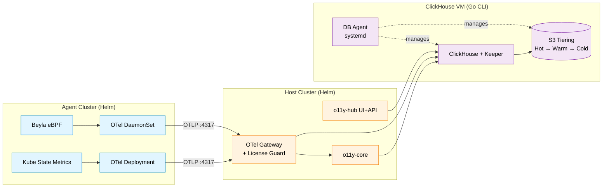
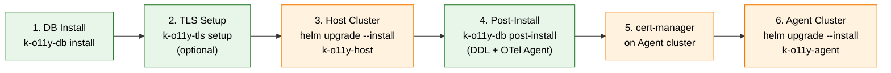

<div align="center">


# K-O11y Install

**Helm charts and Go CLI tools to deploy the full K-O11y stack.**

[English](README.md) | [한국어](README.ko.md)

[](https://www.repostatus.org/#wip)
[](LICENSE)
[](https://helm.sh/)
[](https://kubernetes.io/)

Built on [OpenTelemetry](https://opentelemetry.io/), [Beyla eBPF](https://grafana.com/oss/beyla-ebpf/), and [ClickHouse](https://clickhouse.com/).

</div>

---

## ✨ What's Included

- 📦 **6 Helm Charts** — 2 umbrella charts (`k-o11y-host`, `k-o11y-agent`) + 4 sub-charts
- 🛠️ **2 Go CLI Tools** — `k-o11y-db` (ClickHouse VM installer + DB agent) and `k-o11y-tls` (cert-manager setup)
- 💾 **ClickHouse DDL** — 50+ tables, materialized views, dictionaries, and metadata tables
- 🔐 **TLS Modes** — `existing`, `selfsigned`, `private-ca`, `letsencrypt`
- 🌐 **SSH Modes** — `ssh` (default), `bastion` (jump host), `local` (run on VM)
- 🗄️ **S3 Tiering** — automatic Hot (EBS) → Warm (S3 Standard) → Cold (S3 Glacier IR) lifecycle
- 🔄 **Autonomous DB Agent** — systemd service for S3 activation, cold backup, partition cleanup (no SSH dependency after install)

---

## 🏗️ Architecture

K-O11y uses a **2-tier Host-Agent model**. Agent clusters ship telemetry via OTLP to a central Host cluster; ClickHouse runs on a dedicated VM with a resident DB Agent managing storage tiering.



**Installation flow** (6 steps):



---

## 📦 Project Structure

```
k-o11y-install/
├── charts/                               # Helm charts
│   ├── k-o11y-host/                      # Host umbrella (Backend + OTel Gateway)
│   ├── k-o11y-agent/                     # Agent umbrella
│   ├── k-o11y-otel-agent/                # OTel Collector (sub-chart)
│   ├── k-o11y-otel-operator/             # OTel Operator (sub-chart)
│   ├── k-o11y-apm-agent/                 # Beyla eBPF APM (sub-chart)
│   └── k-o11y-ksm/                       # Kube State Metrics (sub-chart)
│
├── cmd/
│   ├── k-o11y-db/                        # Go CLI: DB install + agent + upgrade
│   │   ├── cmd/                          # cobra subcommands (install, post-install, uninstall, upgrade, agent)
│   │   ├── internal/
│   │   │   ├── agent/                    # DB agent (daemon, poller, s3_activator, backup, health)
│   │   │   ├── installer/                # install logic (keeper, clickhouse, agent, uninstall)
│   │   │   ├── ssh/                      # SSH abstraction (ssh, bastion, local)
│   │   │   └── embed/                    # embedded resources (DDL, scripts, templates)
│   │   └── Makefile                      # cross-compile (linux/darwin, amd64/arm64)
│   │
│   └── k-o11y-tls/                       # Go CLI: TLS certificate setup
│       ├── cmd/                          # cobra subcommands (setup)
│       ├── internal/
│       │   ├── tls/                      # mode-specific logic (existing, selfsigned, private-ca, letsencrypt)
│       │   ├── kube/                     # kubectl/helm wrappers
│       │   └── embed/                    # YAML templates (cert-manager CRD)
│       └── Makefile
│
└── upstream-versions.yaml                # upstream image version tracking
```

---

## 🚀 Installation

> **Pre-built Docker images and OCI-registry Helm charts are not published yet.** Build images from the [main repo](https://github.com/Wondermove-Inc/k-o11y-server), push to your own OCI registry (GHCR, Harbor, etc.), then package and push the Helm charts below.

### Prerequisites

| Item | Requirement |
|------|-------------|
| ClickHouse/Keeper VM | Ubuntu 22.04 LTS, sudo SSH account, 8+ vCPU, 32GB+ RAM |
| Host K8s cluster | Kubernetes 1.28+, Helm 3.12+, kubectl |
| Agent K8s cluster | Kubernetes 1.28+, Linux kernel 5.8+ (for Beyla eBPF) |
| OCI Registry | `<YOUR_REGISTRY>` reachable by both clusters |

Generate `K_O11Y_ENCRYPTION_KEY` up front (reused in Step 1 and Step 3):

```bash
openssl rand -hex 32
```

Build the Go CLI binaries:

```bash
cd cmd/k-o11y-db && make build-all
cd cmd/k-o11y-tls && make build-all
```

Package and push Helm charts to your registry:

```bash
helm package charts/k-o11y-host
helm push k-o11y-host-*.tgz oci://<YOUR_REGISTRY>/charts
```

### Step 1. DB Install + Agent Deployment

```bash
./k-o11y-db install \
    --mode ssh \
    --ssh-user <SSH_USER> \
    --ssh-key <SSH_KEY_PATH> \
    --ssh-password '<SSH_PASSWORD>' \
    --keeper-host <KEEPER_IP> \
    --clickhouse-host <CLICKHOUSE_IP> \
    --clickhouse-password '<CLICKHOUSE_PASSWORD>' \
    --encryption-key <K_O11Y_ENCRYPTION_KEY> \
    --verbose --yes
```

**Installed**: Keeper, ClickHouse, clickhouse-backup, get-s3-creds, DB Agent (systemd)

> The OTel Agent is installed in Step 4 (Post-Install) for CH VM host metrics + ClickHouse Prometheus scraping.

**SSH modes**: `ssh` (default), `bastion` (jump host), `local` (run directly on VM)

### Step 2. (Optional) TLS Setup

Required only when Agents cross VPC / public-network boundaries to reach the Host Gateway.

```bash
./k-o11y-tls setup \
    --mode selfsigned \
    --domain <DOMAIN> \
    --secret-name k-o11y-otel-collector-tls \
    --kube-context <HOST_CONTEXT> -y
```

**Modes**: `existing`, `selfsigned`, `private-ca`, `letsencrypt`

### Step 3. Host Cluster Install

```bash
helm upgrade --install k-o11y-host \
    --kube-context <HOST_CONTEXT> \
    oci://<YOUR_REGISTRY>/charts/k-o11y-host \
    --version <CHART_VERSION> \
    --namespace k-o11y --create-namespace \
    --set externalClickhouse.host=<NLB_DNS_OR_IP> \
    --set externalClickhouse.user=default \
    --set externalClickhouse.password='<CLICKHOUSE_PASSWORD>' \
    --set o11yCore.image.tag=<CORE_TAG> \
    --set o11yHub.image.tag=<HUB_TAG> \
    --set o11yHub.additionalEnvs.CH_HOST=<CLICKHOUSE_VM_IP> \
    --set o11yHub.additionalEnvs.CH_PASSWORD='<CLICKHOUSE_PASSWORD>' \
    --set o11yHub.additionalEnvs.K_O11Y_ENCRYPTION_KEY=<ENCRYPTION_KEY>
```

> **SSO**: disabled by default (`sso.enabled=false`). Enable via `values.yaml` when needed.
> For internal multi-tenant access, add `--set 'o11yHub.sso.allowedTenants=*'`.
> For customer deployments, leave empty — the first login applies **tenant auto-lock**.

**With TLS** (add to the command above):

```bash
    --set otelCollector.tls.enabled=true \
    --set otelCollector.tls.existingSecretName=k-o11y-otel-collector-tls \
    --set otelCollector.tls.path=/etc/otel/tls
```

### Step 4. Post-Install (DDL + OTel Agent)

```bash
./k-o11y-db post-install \
    --mode ssh \
    --ssh-user <SSH_USER> \
    --ssh-key <SSH_KEY_PATH> \
    --ssh-password '<SSH_PASSWORD>' \
    --clickhouse-host <CLICKHOUSE_IP> \
    --clickhouse-password '<CLICKHOUSE_PASSWORD>' \
    --otel-endpoint <HOST_GATEWAY_IP>:4317 \
    --environment <ENV> \
    --verbose
```

**Applied**:
- **DDL**: 50+ tables, MVs, dictionaries, metadata tables (`data_lifecycle_config`, `s3_config`, `sso_config`, `agent_status`)
- **OTel Agent**: otelcol-contrib v0.109.0 (host metrics + ClickHouse Prometheus scraping → Host OTel Gateway)

Omit `--otel-endpoint` to skip the OTel Agent install.

**With TLS** (add):

```bash
    --otel-tls                  # enable TLS
    --otel-tls-skip-verify      # for self-signed certs
```

**Cold backup status values (`last_backup_status`)**:

| Status | Meaning |
|--------|---------|
| `never` | Never executed (initial value) |
| `skipped_no_partitions` | Ran, but no eligible partitions |
| `success` | All target partitions backed up |
| `partial_failure` | Some partitions succeeded, some failed |
| `failed` | All partitions failed |

- Scheduler runs every `backup_frequency_hours` (default 24h)
- Targets all partitions older than `today - hot_days - warm_days`, max 7 per run
- Failed partitions auto-retry on the next cycle

### Step 5. cert-manager (Agent Cluster)

```bash
helm install cert-manager jetstack/cert-manager \
    --namespace cert-manager --create-namespace \
    --version v1.17.1 \
    --set crds.enabled=true \
    --kube-context <AGENT_CONTEXT> \
    --wait --timeout 5m
```

### Step 6. Agent Cluster Install

```bash
helm upgrade --install k-o11y-agent \
    --kube-context <AGENT_CONTEXT> \
    oci://<YOUR_REGISTRY>/charts/k-o11y-agent \
    --version <CHART_VERSION> \
    --namespace k-o11y --create-namespace \
    --set global.clusterName=<CLUSTER_NAME> \
    --set global.deploymentEnvironment=<ENV> \
    --set global.otelInsecure=true \
    --set global.hostEndpointHttp=http://<HOST_GATEWAY_IP>:4318 \
    --set k-o11y-otel-agent.otelCollectorEndpoint=<HOST_GATEWAY_IP>:4317 \
    --set k-o11y-apm-agent.config.data.attributes.kubernetes.cluster_name=<CLUSTER_NAME> \
    --set instrumentation.exporter.endpoint=http://<HOST_GATEWAY_IP>:4317 \
    --wait --timeout 25m
```

**With TLS**: set `global.otelInsecure=false`, change `http://` → `https://`, and for self-signed certs add `k-o11y-otel-agent.insecureSkipVerify=true`.

---

## 📦 Helm Charts

| Chart | Version | Description |
|-------|---------|-------------|
| `k-o11y-host` | 26.2.1 | Host umbrella (Backend + OTel Gateway) |
| `k-o11y-agent` | 26.2.1 | Agent umbrella |
| `k-o11y-otel-agent` | 26.2.1 | OTel Collector (DaemonSet + Deployment) |
| `k-o11y-otel-operator` | 26.2.1 | OTel Operator |
| `k-o11y-apm-agent` | 26.2.1 | Beyla eBPF APM Agent |
| `k-o11y-ksm` | 26.2.1 | Kube State Metrics |

OCI Registry target: `oci://<YOUR_REGISTRY>/charts`

```bash
helm package charts/<CHART_NAME>/
helm push <CHART_NAME>-<VERSION>.tgz oci://<YOUR_REGISTRY>/charts
```

---

## 🛠️ Go CLI Tools

| Binary | Role | Source |
|--------|------|--------|
| `k-o11y-db` | DB install + agent + DDL apply + upgrade + uninstall | `cmd/k-o11y-db/` |
| `k-o11y-tls` | TLS certificate setup (4 modes) | `cmd/k-o11y-tls/` |

**Build (cross-compile, linux/darwin × amd64/arm64):**

```bash
cd cmd/k-o11y-db && make build-all
cd cmd/k-o11y-tls && make build-all
```

**DB Agent** is a systemd service on the ClickHouse VM that polls the DB for configuration and autonomously handles S3 Activation, Cold Backup, and DROP PARTITION — **no SSH dependency after install**.

---

## 🗑️ Uninstall

Uninstall in reverse order of install.

```bash
helm uninstall k-o11y-agent --kube-context <AGENT_CONTEXT> -n k-o11y
helm uninstall k-o11y-host  --kube-context <HOST_CONTEXT>  -n k-o11y

./k-o11y-db uninstall \
    --mode ssh \
    --ssh-user <SSH_USER> \
    --ssh-key <SSH_KEY_PATH> \
    --ssh-password '<SSH_PASSWORD>' \
    --keeper-host <KEEPER_IP> \
    --clickhouse-host <CLICKHOUSE_IP> \
    --verbose --yes
```

---

## 🔄 Upgrade

Upgrades the CH VM components (DB Agent, OTel Agent, DDL). Host/Agent clusters are upgraded via standard `helm upgrade`.

```bash
./k-o11y-db upgrade \
    --mode ssh \
    --ssh-user <SSH_USER> \
    --ssh-key <SSH_KEY_PATH> \
    --ssh-password '<SSH_PASSWORD>' \
    --clickhouse-host <CLICKHOUSE_IP> \
    --clickhouse-password '<CLICKHOUSE_PASSWORD>' \
    --otel-endpoint <HOST_GATEWAY_IP>:4317 \
    --verbose --yes
```

| Target | Trigger | On failure |
|--------|---------|------------|
| DB Agent | Always | Auto-rollback (`.bak` restore) |
| OTel Agent | When `--otel-endpoint` is set | Auto-rollback (config restore) |
| DDL migration | When `--clickhouse-password` is set | Idempotent (`IF NOT EXISTS`) |

Check version: `./k-o11y-db --version`

---

## 🔗 Related Repositories

| Repository | Description |
|------------|-------------|
| 🌐 **[k-o11y](https://github.com/Wondermove-Inc/k-o11y)** | Umbrella repo (overview, architecture, roadmap) |
| 🧠 **[k-o11y-server](https://github.com/Wondermove-Inc/k-o11y-server)** | Observability backend + ServiceMap Core API |
| 📡 **[k-o11y-otel-collector](https://github.com/Wondermove-Inc/k-o11y-otel-collector)** | OTel Collector with CRD label enrichment |
| 🛂 **[k-o11y-otel-gateway](https://github.com/Wondermove-Inc/k-o11y-otel-gateway)** | OTel Gateway with License Guard |

---

## 🤝 Contributing

Contributions are welcome — especially on [good first issues](https://github.com/search?q=org%3AWondermove-Inc+label%3A%22good+first+issue%22+is%3Aopen&type=issues).

1. **Find an issue** labeled `good first issue` or `help wanted`
2. **Comment on the issue** to claim it (avoid duplicate work)
3. **Fork, branch, and send a PR** — scope narrowly, describe clearly
4. **Address review feedback** — maintainers respond within a few days

This project follows **passive maintenance** — we aim to respond within 7 days but cannot guarantee faster turnaround.

---

## 📄 License

[MIT License](LICENSE) — inherited from [SigNoz](https://github.com/SigNoz/signoz).

---

## 💬 Contact

- 🐛 **Bug reports & feature requests**: [GitHub Issues](https://github.com/Wondermove-Inc/k-o11y-install/issues)
- 💭 **Questions & discussions**: Open an issue in the [umbrella repo](https://github.com/Wondermove-Inc/k-o11y/issues)
- 🌐 **Website**: [www.skuberplus.com](https://www.skuberplus.com)

---

<div align="center">

**Built and maintained by [Wondermove](https://www.skuberplus.com)**

</div>
